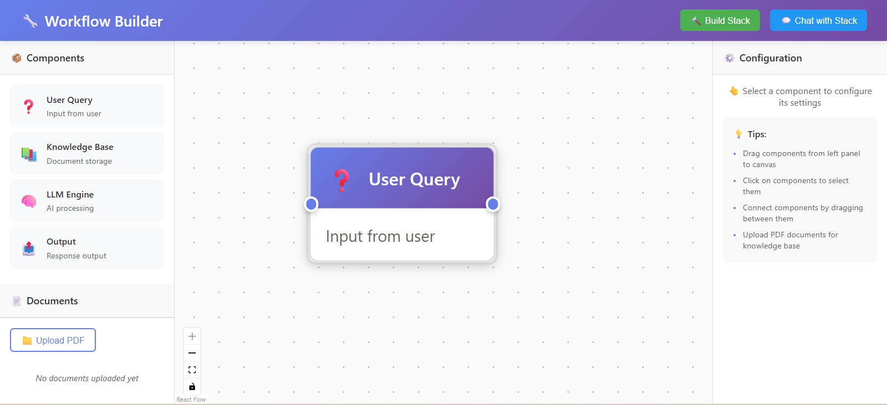

🚀 Workflow Builder
A full-stack app that lets users upload PDFs, build drag-and-drop workflows, and chat with documents using AI — no code needed!

✨ Features
🧩 Visual workflow builder (drag & drop)

📄 PDF text extraction with auto-processing

🤖 Chat with documents using OpenAI (or fallback)

✅ Smart error handling & real-time validation

📱 Mobile-responsive, clean UI

🛠️ Tech Stack
Frontend: React.js, React Flow, Vite
Backend: FastAPI, PyMuPDF, OpenAI API (or mock), Uvicorn

🔧 Getting Started
Frontend Setup:

bash
Copy
Edit
npm install
npm run dev
# http://localhost:5173
Backend Setup:

bash
Copy
Edit
npm run backend-install
cp backend/.env.example backend/.env  # Add your OpenAI key if available
npm run backend
# http://localhost:8000
📁 Folder Highlights
css
Copy
Edit
src/        → Frontend UI & logic
backend/    → FastAPI server & endpoints
🔌 API Overview
Method	Endpoint	Purpose
POST	/upload-document	Upload and extract PDF text
POST	/generate-embeddings	Generate document embeddings
POST	/execute-workflow	Chat with documents via AI
GET	/documents	View uploaded docs

🌟 What Makes It Special
📦 Works offline (mock fallback if OpenAI is unavailable)

🖱️ Smooth UX with drag-drop, feedback & validation

📲 Fully responsive and mobile-ready

🔄 Clean architecture, easy to extend

📸 Screenshot
Workflow Builder Interface
## 📸 Screenshot

🔮 Future Enhancements
Auth & multi-user support

DB integration (PostgreSQL / MongoDB)

Template workflows for quick start

Support for more AI models (Claude, Gemini)

👨‍💻 About
Built with ❤️ by Aditya Thakur

